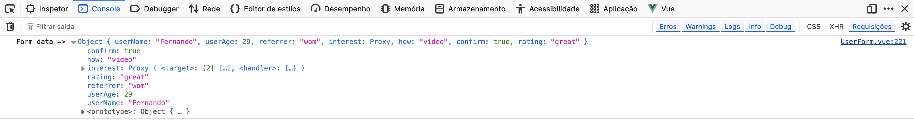

# Simple Form Vue Project

## About The Project

**Simple Form Vue Project** is a web application built with Vue.js that demonstrates a modern, modular form interface. The application collects various user inputs—including text, numbers, checkboxes, radio buttons, and a custom star-based rating component—and is prepared to integrate with API endpoints for further processing.

### Preview

Below are some screenshots demonstrating the interface of the project:

#### Home Page


#### Chat Interface and Example of a Conversation


### Creator's Message
This project was developed using Vue CLI and modern JavaScript tooling. The entire codebase follows best practices for clean code and modular design. The focus was on building an interactive, user-friendly form that can easily be extended to connect with backend APIs.

## Built With

- 
- 
- HTML5
- CSS3

## Getting Started

### Prerequisites

- [Node.js](https://nodejs.org) and npm installed on your system.
- Basic knowledge of Vue.js (optional).

### Installation

1. **Clone the repository:**
   ```bash
   git clone https://github.com/ferriblima/simple-form-vue.git
   cd simple-form-vue
   ```
2. **Install dependencies:**
   ```bash
   npm install
   ```
3. **Run the development server:**
   ```bash
   npm run serve
   ```
   or, if you prefer:
   ```bash
   npm run dev
   ```
4. **Open your browser** and navigate to `http://localhost:8080` or your configured alias (e.g., `http://simple-form-vue.co`).

## Usage

This project demonstrates a form built with Vue.js, featuring:
- **Text Input:** For entering your name.
- **Number Input:** For entering your age.
- **Select Input:** For choosing a referrer.
- **Checkboxes and Radio Buttons:** For selecting interests and learning methods.
- **Custom Rating Control:** A star-based component that allows users to rate their experience.

### Main Files
- **src/views/UserForm.vue**: The primary component containing the form.
- **src/components/RatingControl.vue**: A custom component that provides a star-based rating interface.
- **public/index.html**: The HTML template used by the Vue CLI.

## Roadmap

- [x] Build a dynamic form using Vue components.
- [x] Create a custom rating control with interactive stars.
- [ ] Integrate the form with a backend API for data submission.
- [ ] Implement unit tests and end-to-end tests.

## Contributing

Contributions are welcome and appreciated! To contribute:
1. Fork the project.
2. Create your feature branch:  
   ```bash
   git checkout -b feature/AmazingFeature
   ```
3. Commit your changes:  
   ```bash
   git commit -m 'Add some AmazingFeature'
   ```
4. Push to the branch:  
   ```bash
   git push origin feature/AmazingFeature
   ```
5. Open a Pull Request.

## License

Distributed under the **Unlicense License**. See `LICENSE.txt` for more information.

## Contact

**Fernando Lima**  
[LinkedIn](https://www.linkedin.com/in/fernandoribeirolima/) - ferriblima@gmail.com

Project Link: [https://github.com/ferriblima/simple-form-vue](https://github.com/ferriblima/simple-form-vue)

## Acknowledgments

- [Vue.js Documentation](https://vuejs.org)
- [HTML5 & CSS3 Standards](https://www.w3.org)
- [Best README Template](https://github.com/othneildrew/Best-README-Template)
